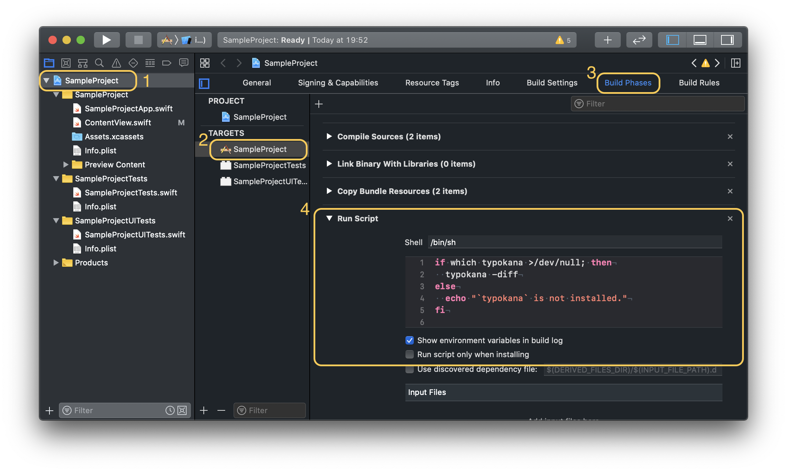

# No more "Fix typo" commit...!

This command line tool can check spelling and show proposed correction.


## Installation

### Binary

We can download binary from [here](https://github.com/ezura/spell-checker-for-swift/releases).

### Makefile

```shell
$ git clone git@github.com:ezura/spell-checker-for-swift.git
$ cd spell-checker-for-swift
$ make
```

### [Mint](https://github.com/yonaskolb/mint)

```shell
$ mint install ezura/spell-checker-for-swift@5.3.0
```

## Usage

### With Xcode

#### Set up
Run `typokana init` in the same directory as xcodeproj file.

#### Add run script


To display warnings on Xcode, add a command into "Run Script Phase".
```
if which typokana >/dev/null; then
  typokana --diff-only
else
  echo "`typokana` is not installed."
fi
```
This setting is searching typos only in changed swift files (fetched with `git diff`).

If you want to select a target directory, add the directory path.
```
if which typokana >/dev/null; then
  typokana /Sources
else
  echo "`typokana` is not installed."
fi
```

### Command

#### `typokana init`
Prepare a list of words that the spell checker ignores.  
`typokana init` creates ".typokana_ignore" in the current directory.

#### `typokana`
Search typo in all swift files.  
Show warning for typo on Xcode when this command is run at "Run Script".

#### `typokana -diff`
This command is recommended.  
Search typo only in changed swift files (fetched with `git diff`).

#### `typokana --language`
Change the language to use for spell checking, e.g. "en_US" (defaults to using the system language).
(`typokana --language en_US`)

#### `typokana --help`
 (`typokana --help`)
 
```
OVERVIEW: Spell check

USAGE: typokana [options] argument

OPTIONS:
  --diff-only, -diff   Check only files listed by `git diff --name-only`
  --language, -l       The language to use for spell checking, e.g. "en_US" (defaults to using the system language).
  --help               Display available options

POSITIONAL ARGUMENTS:
  path | init          Path to target file | set up typokana
```

### How to ignore words
1. Create file named ".typokana_ignore"
1. Write ignored words with line breaks

For example, if you don't want to display warnings for "typokana", "json" and "yuka", please write following text in ".typokana_ignore".
```text:.typokana_ignore
typokana
json
yuka
```

## TODO

* [x] edit the list of words to ignore
