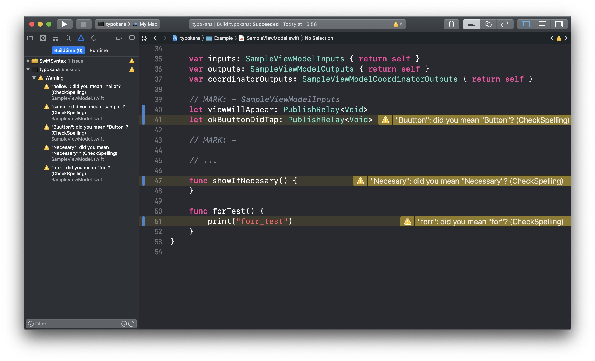

# spell checker and corrector for Swift

This command line tool can check spelling and show proposed correction.



## Installation

### Binary

We can download binary from [here](https://github.com/ezura/spell-checker-for-swift/releases).

### Makefile

```shell
$ git clone git@github.com:ezura/spell-checker-for-swift.git
$ cd spell-checker-for-swift
$ make
```

### [Mint](https://github.com/yonaskolb/mint)

```shell
$ mint install ezura/spell-checker-for-swift
```

## Usage
### Command

#### `typokana { path of file/directory }`
Show warning on Xcode when run this command at run script.

#### `typokana --help`
```
OVERVIEW: Spell check

USAGE: typokana [options] argument

POSITIONAL ARGUMENTS:
  path   Path of target file
```

## TODO

* [ ] edit the list of words to ignore
